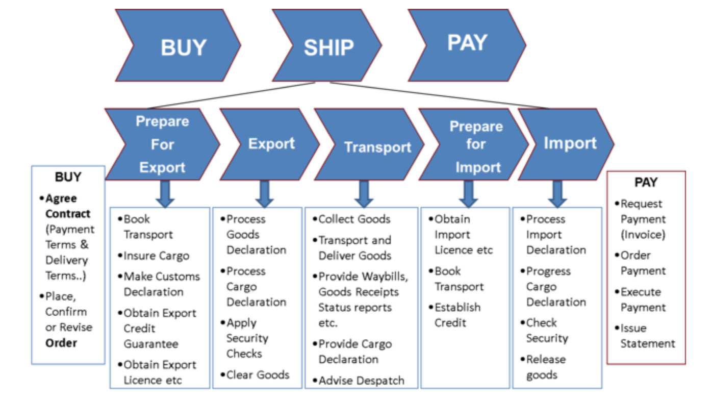
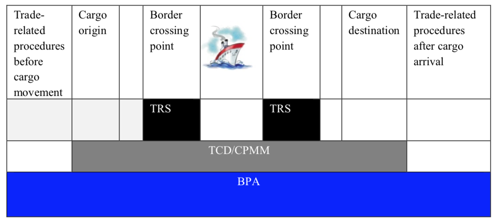
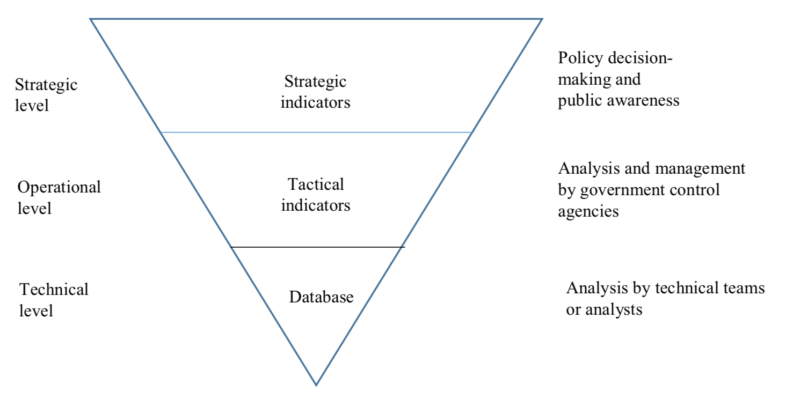

= Trade and Transport Facilitation Monitoring Mechanism
:title: Trade and Transport Facilitation Monitoring Mechanism
:doctype: recommendation
:docnumber: 42
:committee: United Nations Centre for Trade Facilitation and Electronic Business (UN/CEFACT)
:copyright-year: 2017

[abstract]
.Foreword
It is my pleasure to introduce this new recommendation on monitoring the effectiveness of policies and procedures that facilitate trade and speed up international supply and value chains. Facilitating trade is one of the vectors to improving peoples’ lives and reducing inequalities. Using international standards and standard procedures creates a level playing field for all actors in both developed and developing economies.

There is a need, however, for countries to establish sustainable national trade and transport facilitation monitoring mechanisms to measure and assess progress and to assist in policy making and modernization efforts.

Recommendation 42 on Trade and Transport Facilitation Monitoring Mechanisms (TTFMM) addresses issues related to institutional arrangements and methodology in designing and implementing TTFMM. It is an important contribution to UNECE’s suite of Trade Facilitation recommendations and guidance material.

Olga Algayerova +
Executive Secretary +
United Nations Economic Commission for Europe

== Recommendation n° 42: Establishment of a Trade and Transport Facilitation Monitoring Mechanism (TTFMM)
=== Introduction
  
Many countries around the world have made efforts to facilitate trade and transport. Few, however, have established sustainable mechanisms to monitor the effectiveness of policies and procedures that facilitate trade and speed up international supply and value chains.

Several global trade facilitation performance surveys and databases{blank}footnote:[Some examples of this are the World Bank’s Logistics Performance Index (LPI) and Doing Business databases, the Word Economic Forum Executive Opinion Surveys, and the ESCAP-World Bank Trade Cost Database (see <<annex1>>).] are now available, and have proven very useful as benchmarking and awareness raising tools. They do not, however, provide sufficiently detailed information to assist in developing or updating national trade facilitation action plans.

Trade and transport facilitation assessments have also been conducted in some countries. In many cases these are ad hoc in nature, with little coordination among development partners, and with limited support from the governmental agencies involved.

There is, therefore, a need for countries to establish sustainable national trade and transport facilitation monitoring mechanisms to measure and assess progress in trade and transport facilitation and to assist in formulating, updating and prioritizing recommendations for trade and transport facilitation.

This present recommendation builds on existing UNECE Recommendations. In particular, this recommendation proposes that a country, whenever appropriate, should collect data on trade and transport facilitation based upon the Buy-Ship-Pay Model, which is covered by Recommendation n°18.footnote:[UNECE Recommendation n°18 Facilitation Measures Related to International Trade Procedures, available at http://www.unece.org/fileadmin/DAM/cefact/recommendations/rec18/Rec18_pub_2002_ecetr271.pdf (accessed 17 January 2017).] This Recommendation emphasizes the importance of institutional arrangement of TTFMMs. It proposes that National Trade Facilitation Bodies (NTFB), as discussed in Recommendation n°4,footnote:[UNECE Recommendation n°4 National Trade Facilitation Bodies, available at http://www.unece.org/fileadmin/DAM/cefact/recommendations/rec04/ECE_TRADE_425_CFRec4.pdf (accessed 17 January 2017).] whenever possible, should lead their respective TTFMMs. It also highlights the importance of engagement and consultation among multiple stakeholders—the topic of Recommendation n°40.footnote:[UNECE Recommendation n°40 Consultation approaches Best Practices in Trade and Government Consultation on Trade Facilitation matters, available at http://www.unece.org/fileadmin/DAM/cefact/cf_plenary/plenary15/ECE_TRADE_C_CEFACT_2015_9_Rev1E_Rec40_RevFinal.pdf (accessed 17 January 2017).]

=== Purpose
The purpose of this Recommendation is to encourage governments, business communities, development partners and international organizations to collaborate in the development of sustainable Trade and Transport Facilitation Monitoring Mechanisms (TTFMMs). Accordingly, this Recommendation addresses issues related to institutional arrangements and methodology in designing and implementing a TTFMM.

=== Scope
This Recommendation is primarily focused on TTFMMs at the national level. However, many of the basic principles can be equally applied to local, sub-regional, regional, and global levels.

=== Benefits
The adoption of a TTFMM will bring the following benefits to a country: 

* Cost-effective and sustainable monitoring of trade and transport facilitation;
* Reliable, systematic, consistent and harmonized data available for policymaking and modernization;
* Enhanced national human capacity for trade and transport facilitation; and
* Streamlined trade and transport procedures, improved trade efficiency and enhanced trade competitiveness.

=== Recommendation
In the light of the above, UN/CEFACT at its twenty-third Plenary session in April 2017 in Geneva recommended the following:

* Governments and trade should establish national Trade and Transport Facilitation Monitoring Mechanisms (TTFMMs);
* Governments and trade should consider undertaking the following measures to ensure the sustainability of TTFMMs:
** Build national capacity to ensure that TTFMM activities, whenever possible, are carried out by national experts and teams; and
** Institutionalize TTFMMs: A body overseeing the functioning of a TTFMM should include representatives of all, or key, stakeholders in trade and transport facilitation; and National Trade Facilitation Bodies, whenever possible, should be fully utilized to lead the activities under a TTFMM.
* International organizations and development partners, whenever possible, should extend their assistance to countries in need, to assist them in establishing their own TTFMMs – and especially the Least Developed Countries (LDCs), Landlocked Developing Countries (LLDCs) and Small Island Developing Countries (SIDS).
 
== Guidelines for Recommendation n°42 on the establishment of a Trade and Transport  Facilitation Monitoring Mechanism (TTFMM)
=== Introduction
There is a need for countries to establish sustainable national Trade and Transport Facilitation Monitoring Mechanisms (TTFMMs) to measure and assess progress in trade and transport facilitation and assist in formulating, updating and prioritizing recommendations for trade and transport facilitation. Experiences have shown that trade and transport facilitation assessments have been successfully conducted in some countries. However, in many cases they are ad hoc in nature, with little coordination among development partners, and with limited support from the governmental agencies involved.

The purpose of this Recommendation is to encourage governments and the business community to collaborate in the development of a sustainable TTFMM methodology. Accordingly, this Recommendation addresses issues related to institutional arrangement and methodology in designing and implementing a TTFMM. This Recommendation is primarily focused on the national level. However, many of the basic principles can be equally applied to local, sub-regional, regional, and global levels.

=== Institutional arrangement
Institutionalizing a TTFMM is a prerequisite to ensuring its sustainability. A body overseeing the functioning of a TTFMM should include representatives of all, or at least key, stakeholders in trade and transport facilitation. Such a body could be the National Trade Facilitation Body (NTFB), a subsidiary body under the NTFB, or a similar institution if already in place.footnote:[Such institutions may include a National Body on Trade Facilitation as per the requirement under Art. 23.2 of the World Trade Organization Trade Facilitation Agreement.] In fact, operation of a TTFMM should be a core function of the NTFB because a TTFMM will provide the information needed to make decisions and drive the trade facilitation reform. If such a NTFB is not in place, an inter-agency trade facilitation performance assessment and monitoring body could be initiated by/under the trade facilitation lead agency which will be eventually upgraded to, or integrated into a NTFB (in line with the requirement for an NTFB under the World Trade Organization (WTO) Trade Facilitation Agreement).

Stakeholders in trade and transport facilitation within the territory covered by a TTFMM should be invited to participate. The private sector may play a very active or leading role in trade and transport facilitation monitoring. The need for a TTFMM as outlined above, should be made clear to the public and to any stakeholders relevant to trade and transport facilitation.

=== Scope of monitoring
==== General principle for defining scope of monitoring
The scope of monitoring should be decided by a country according to its specific situation. Two different countries may have different priorities for the monitoring. For instance, a landlocked country may be eager to monitor the procedures at land border posts, while an island country may be most concerned about the performance at ports and shipping connectivity. Consultation meetings with stakeholders should be arranged to decide the scope of monitoring.

NOTE: When defining the scope of monitoring, Specific, Measureable, Achievable, Relevant and Time-bound (SMART) criteria should be adopted whenever appropriate.
   
|===
h|Specific | The areas for monitoring need to be clear and unambiguous.
h|Measureable | A country needs to review its resources and capacity for the monitoring exercise. If the monitoring exercise is carried out for the first time, the country may be focused on a small number of strategically important procedures, products or trade routes for the monitoring exercise. Over time, with enhanced national capacity and experiences, more products and trade routes can be included for monitoring.
h|Relevant  | The areas of monitoring need to be strategically important and relevant for a country.
h|Time-bound | The time-frame and target dates for the monitoring exercises need to be clear to all stakeholders.
|===

The country may consider processes, products and/or trade routes and corridors when defining the scope of monitoring (as elaborated in sections <<scope-process>> through <<trade-routes-corridors>>, below).

[[scope-process]]
==== Process
Countries, whenever appropriate, are encouraged to adopt a whole-of-supply-chain approach for the scope of their monitoring exercises to ensure that the solutions identified for enhancing trade and transport facilitation are encompassing and comprehensive. To this end, the Buy-Ship-Pay model{blank}footnote:[This model is included in UNECE Recommendation n°18 Facilitation Measures Related to International Trade Procedures, available at http://www.unece.org/tradewelcome/un-centre-for-trade- facilitation-and-e-business-uncefact/outputs/cefactrecommendationsrec-index/list-of-trade-facilitation-recommendations-n-16-to-20.html (accessed 17 January 2017).] (as shown in <<Figure1>>) should be considered by the country when setting up the scope of monitoring. The scope of monitoring could cover the whole- of-supply-chain process (i.e. all of Buy-Ship-Pay) or, in some cases, the scope might be confined to selected processes in the Buy-Ship-Pay model, according to the priorities of the country.

[[Figure1]]
.UNECE Recommendation n°18 illustrates a simplified view of the international supply chain in the Buy-Ship-Pay model. The model identifies the key commercial, logistical, regulatory and payment procedures involved in the international supply chain. Source: http://tfig.unece.org/contents/buy-ship-pay-model.htm.

==== Products
When selecting products for monitoring, and whenever possible, one or more of the following factors should be taken into consideration:

* The products should be strategically important for the country or the region;
• The products should be relevant for small and medium-sized enterprises (SMEs), particularly in the agricultural sector;
* The products should contribute significantly to the creation of employment;
* The product should have a high frequency of shipments;
* The product should have a high economic value to the country or region;
* The trade process for the product should include common (or many) bottlenecks, a high number of agencies and/or inefficient procedures; and
* The product should be relevant to the health, well-being and/or social cohesion of citizens.

[[trade-routes-corridors]]
====  Trade routes and corridors{blank}footnote:[According to the World Bank, a trade and transport corridor is a coordinated bundle of transport and logistics infrastructure and services that facilitates trade and transport flows between major centers of economic activity. Source: Carruthers, Robin; Kunaka, Charles. 2014. Trade and transport corridor management toolkit. Washington DC; World Bank Group.]

The trade routes and corridors to be assessed should be selected primarily as a function of the products selected for assessment and/or because of their economic importance. In the case where products are transported along different corridors, priority should be given to those corridors which are most frequently used or are more strategically important to the country or region. Consultation with the private sector could be very useful in identifying such corridors.

==== Data available from international organisations
International trade and transport facilitation indicators already collected by international organizations should be considered when developing a general overview of national trade and transport facilitation. Such indicators may be derived from (among others) the ESCAP{blank}footnote:[Economic and Social Commission for Asia and the Pacific (ESCAP).]-World Bank Trade Cost database, the World Bank Logistics Performance Index, the World Bank Doing Business/Trading Across Borders Indicators, the UNCTAD{blank}footnote:[United Nations Conference on Trade and Development (UNCTAD).] Liner Shipping Connectivity Index, the OECD{blank}footnote:[Organization for Economic Cooperation and Development (OECD).] Trade Facilitation database, the United Nations Regional Commissions Trade Facilitation and Paperless Trade Implementation Survey database, the World Economic Forum’s Global Competitiveness Index, and ADB’s CAREC{blank}footnote:[Asian Development Bank (ADB) Central Asia Regional Economic Cooperation (CAREC).] Corridor Performance Measurement and Monitoring.footnote:[An overview of different indicators is shown in <<annex1>>.] A description of some of these indicators can be found in <<annex1>>.

=== Data collection methodology and indicators
Data collection, including (among others) the types of data and data collection methods, should be defined within, and at the same time as, the scope of monitoring. The methods for data collection, calculation and aggregation (whenever possible) should be selected, aligned and harmonized so as to facilitate, to the greatest extent possible, national, regional and international comparisons. Data collection should be reviewed and conducted on regular basis for the purpose of effective monitoring (e.g. monthly, quarterly, or yearly as appropriate).

==== Relevant data in automated systems should be utilized to the maximum extent possible
Data related to trade and transport facilitation monitoring, in an automated system such as ASYCUDA{blank}footnote:[Automated SYstem for CUstoms DAta (ASYCUDA)] (e.g. the time to submit customs declarations and the time within which each customs declaration is approved) should be fully utilized if such data is available in an existing system. More proactively, when designing and developing automation systems, data related to trade and transport facilitation monitoring should be included in the implemented system whenever possible.

Some necessary data will not be available from existing automated systems in a country. Any TTFMM should consider developing a methodology to collect further data which would be pertinent to the monitoring as identified through its specific business use case.footnote:[See UNECE Recommendation n°34 on Data Simplification and Standardization for International Trade, available at http://www.unece.org/fileadmin/DAM/trade/Publications/ECE-TRADE-400E_Rec34.pdf (accessed 14 December 2016).]

==== Business Process Analysis (BPA) as a potential method for data collection{blank}footnote:[UN/CEFACT has developed such a methodology called “Business Requirement Specification”, available at http://www.unece.org/cefact/brs/brs_index.html (accessed 14 December 2016).]

It is recommended that countries utilize published instruments and existing tools and techniques for business process analysis. An example of this is the UNNExT _Business Process Analysis Guide to Simplify Trade Procedures_{blank}footnote:[For more information, refer to UNNExT, 2012, _Business Process Analysis Guide to Simplify Trade Procedures_, UNNExT. available at http://www.unescap.org/resources/business-process-analysis-guide-simplify-trade-procedures (accessed 2 January 2017).] which was developed to assist in the collection and analysis of data, the construction of databases and the generation of appropriate indicators.
24. Other trade and transport facilitation monitoring methods such as Time-Cost- Distance (TCD){blank}footnote:[More information is available at http://www.unescap.org/resources/timecost-distance-methodology (accessed 14 December 2016).], Corridor Performance Measurement and Monitoring (CPMM){blank}footnote:[For more information, refer to ADB, _Central Asia Regional Economic Cooperation Corridor Performance Measurement and Monitoring: A Forward-Looking Retrospective_ (Manila, 2014). Available at https://www.adb.org/sites/default/files/publication/148731/carec-cpmm-forward-looking-retrospective.pdf (accessed 2 January 2017).] and WCO Time Release Studies (TRS) can also be utilized to supplement BPA. The complementary nature of BPA and other methods, collectively called BPA+, are described in <<Box1>>.

[[Box1]]
[IMPORTANT]
.Business Process Analysis Plus (BPA+)
====
Business Process Analysis was initially designed to document and evaluate an import/export process at a given point time and its relative simplicity. It also specifically includes a measurement of the time and cost of the complete range of procedures as one of the main outputs of the analysis. This combination makes it suitable as the basis/core of a trade facilitation monitoring and improvement system.

The Business Process Analysis Plus (BPA+) approach is built upon the BPA concept and supplemented by other methods such as Time-Cost-Distance (TCD), Corridor Performance Measurement and Monitoring (CPMM) and Time Release Studies (TRS).

TCD/CPMM and TRS, which focus on a subset of procedures covered by BPA (See the Figure above) and provide alternative data collection methods, could be used to verify and supplement the data and outputs from the standard BPA. BPA data is typically based on interviews with key informants, which are verified through stakeholder consultation(s), while TCD/CPMM is often based on the accumulation of quantitative information provided by drivers moving a single shipment along a selected route. TRS is based on data collection forms filled by Customs officers, customs brokers or electronic time stamps (when available) for a sample of shipments/customs declarations.

Another difference between BPA and the other two methods (TRS and TCD/CPMM) is that BPA not only provides indicators, but also provides a ‘standard’ way of analyzing indicators, trade procedures, identifying bottlenecks and diagnosing trade barriers—while the other two methods mainly provide indicators.

Source: The box is derived from an ESCAP-ADB publication entitled _Towards a National Integrated and Sustainable Trade and Transport Facilitation Monitoring Mechanism: BPA+_ (2014). Available as of 14 December 2016 at: <http://www.unescap.org/resources/towards-national-integrated-and-sustainable-trade-and-transport-facilitation-monitoring>.
====

====  Construction and updating of national database
The executive body of a TTFMM, such as a NTFB, should develop, maintain and update a national TTFMM database. The database should include the following data whenever possible:

* Trade process descriptions, process flows and related rules/regulations for each, trade & transport procedures for selected processes/products along selected corridors;
* Time, cost, number of documents for each process/procedure and number of total processes;
* International trade and transport facilitation indicators whenever appropriate.

The rationale for structuring the database in such way is that, while international trade and transport facilitation indicators provide an overview of trade and transport facilitation in a country vis-à-vis other countries, data related to specific trade processes, products, and/or specific trade corridors provide more detailed information for analysis and the development of specific recommendations for remedial action.

=== Data analysis and recommendations 
==== Presentation of data and key results
Data should be presented in a very user-friendly manner whenever possible. For this purpose, data may be grouped into different tiers, as shown in <<figure2>>. The top tier data should be a small number of indicators which are targeted for policy decision-making or general public awareness. The middle tier of data should be structured to assist government control agencies to analyse and manage trade and transport facilitation. The lower tier database provides information that is as detailed as possible for eventual analysis by technical teams or analysts. An example of top- and middle-tiers indicators is given in <<annex2>>. This classification is largely in line with the Recommendation n°40 on “level of participation”.

[[figure2]]
.Recommended tier of indicators and database

==== Analytical report (including, among others, key policy recommendations)
The Executive Body of the TTFMM needs to ensure that a consistent set of recommendations emerges from the analysis of the data collected. It is recommended that national-level or focus-group consultation(s) be held to validate the TTFMM analytical results and recommendations. The prioritized recommendations should then be put forward for further consideration and potential implementation by the Executive Body.

Recommendations emerging from the studies should be linked to ongoing and planned trade facilitation modernization projects to increase the likelihood of implementation in a timely manner. While the Executive body of the TTFMM should have a comprehensive understanding of the various trade facilitation modernization activities taking place in the country, consultations on specific recommendations with trade and transport facilitation project managers, and the organizations supporting them (including bilateral donors and international financial institutions) may be particularly useful at this stage.

=== Policy formulation and action plans
==== Communicating the results and recommendations
Once the study is finalized, the Executive Body of the TTFMM (e.g. the NTFB) needs to communicate relevant results and recommendations to target audiences and stakeholders. In line with the general principles of transparency, data security, privacy and confidentiality, as much of the study results as possible should be made publicly available. At the same time, the Executive Body, in consultation with relevant study teams and working groups (e.g. TRS working group) may decide to release only part of the results and performance data—or to release them in a more aggregated form when dealing with issues considered sensitive (for confidentiality or security reasons). Similarly, if releasing data collected from the private sector, it is advisable that the data be presented at the aggregate level in order to protect company privacy and encourage honest responses.

==== Formulating policy or action plans
Key recommendations and a brief summary of the study report should be presented to high-level policy and decision makers. The commitment and political support from them is not only essential for the sustainability of the TTFMM but also to ensure that the recommendations generated by the TTFMM can be translated into concrete actions and projects for modernization.

=== National capacity development
As part of ensuring the sustainability of a TTFMM, the national human capacity for undertaking such studies needs to be developed and maintained. National experts and process owners, rather than international experts, should be involved in conducting the assessment and performance studies, with project resources (available for the establishment of the TTFMM) specifically allocated to building national capacity.

One type of stakeholder, which may be pertinent to a TTFMM, and good to involve, are existing national think tanks or research institutions that already have a mandate for trade or economic development, and which could, therefore, support the trade facilitation performance studies under their existing—or a slightly expanded—mandate.

To further increase sustainability, a “training of trainers” mechanism may be established, whereby those receiving initial training are asked to commit to sharing the knowledge they have gained by training others. The ultimate goal is to create a pool of proficient local experts (or institutions) to conduct all of the essential studies.

Priority for participation in capacity building activities should be carefully thought out and given to those most likely be involved directly in the studies and related activities, including, for example, NTFB members and Secretariat staff (or staff from the lead agency), Customs officers, personnel from trucking or freight-forwarders’ associations, and the staff of trade-related research institutions.

=== Resources
In the long term, the operation of a TTFMM is likely to be underpinned by national resources, as well as external assistance from development partners or donors. While an adequate and separate budget may be provided by the Government for operation of a TTFMM, given its broad social and economic benefits, innovative solutions towards system sustainability should be considered (such as key government agencies providing qualified staff on a part-time or full-time basis to conduct the studies). While this latter solution may raise issues regarding the neutrality of the outputs of the TTFMM, this approach could be useful in building the capacity of officials that will continue to serve—or ultimately return to—their original agency.

A Public-Private Partnership (PPP){blank}footnote:[See UNECE Recommendation n°41: Public Private Partnership in Trade Facilitation, available at http://www.unece.org/cefact/recommendations/rec_index.html (accessed 17 January 2017).] could also be envisaged: with part of the resources for a TTFMM coming from private sector organizations such as Chambers of Commerce or Industry Associations, taking into consideration the benefits a TTFMM can bring to the business community. The private sector contribution could be in the form of an in-kind contribution (e.g. staff secondment or the allocation of staff time to collect and/or analyse data). In this context, communicating with the general public on the benefits of TTFMM, presenting useful results on a regular basis and showcasing the achievements will be important to win continuous and broad-based support—including financial support— from a wide range of public and private stakeholders.

Once the usefulness of a TTFMM is fully recognized by all relevant stakeholders, development partners, financing institutions and international donors are also likely to support the operation of the TTFMM. This would be particularly useful for the least developed countries (LDCs), landlocked developing countries (LLDCs), Small Island Developing Countries (SIDS) and other developing economies with limited resources.

=== International support
Some countries, especially those identified in the previous section, may face difficulties in putting a TTFMM in place on their own. They may require technical and financial assistance, and capacity building—at least in the initial stage of establishment and operation. International organizations and development partners should extend such assistance whenever possible.

=== Collaboration with neighbouring countries
While a TTFMM usually has a national scope, some countries (and particularly landlocked developing or transit countries) are very much dependent on other countries for facilitating trade. In such cases, bilateral or sub-regional mechanisms will be needed to enable the sharing of information, to conduct cross-border studies for monitoring progress, and to identify simplification measures and modernisation projects needed along the relevant international supply chains. Some suggestions for cross-country indicators that could contribute to establishing the basis for a regional TTFMM can be found in <<annex1>>.

=== Gender considerations
UN/CEFACT is committed to ensuring that the gender dimension is reflected in norms, roles, procedures, and access to resources. Government and trade are encouraged to promote equal opportunities for women and men within the scope of the activities of National Trade Facilitation bodies or similar institutions. UN/CEFACT specifically encourages the collection, analysis, and monitoring of gender disaggregated data in order to better understand and support women’s engagement in international trade and transport facilitation.

This Recommendation encourages governments, business communities, development partners, international organizations, and other policymakers to follow UN/CEFACT ́s commitment to ensure inclusiveness for women.

[[annex1]]
[appendix]
== An overview of different cross-country indicators{blank}footnote:[The summary of each indicator has been made as concise as possible because of the constantly evolving nature of these indicators. Readers are advised to browse the relevant website to obtain the latest information on the composition of each indicator.]

=== UNCTAD Liner Shipping Connectivity Index
UNCTAD Liner Shipping Connectivity index (LSCI) serves as an indicator of a country’s level of integration into global liner shipping networks. The degree of a country’s access to world markets depends largely on their transport connectivity, especially when it comes to regular shipping services for the import and export of manufactured goods. The LSCI is therefore generated using data such as number of ships; total container-carrying capacity of those ships; maximum vessel size; number of services; and number of companies that deploy container ships on services to and from a country’s ports.

=== ESCAP-World Bank Trade Cost database
The trade cost measure is a comprehensive all-inclusive measure based on micro-theory and calculated using macroeconomic data. The current version includes data from 1995 to 2014 for over 180 countries. Available as of 14 December 2016 at: http://databank.worldbank.org/data/reports.aspx?source=escap-world-bank-international-trade-costs.

=== World Bank Logistics Performance Index (LPI)
The LPI is based on a worldwide survey of operators on the ground (global freight forwarders and express carriers) providing feedback on the logistics “friendliness” of the countries in which they operate and those with which they trade. Available as of 14 December 2016 at: http://lpi.worldbank.org/

=== World Bank Doing Business / Trading Across Borders Indicators
Doing Business records the time and cost associated with the logistical process of exporting and importing goods. Available as of 14 December 2016 at: http://www.doingbusiness.org/data/exploretopics/trading-across-borders#.

=== OECD Trade Facilitation database
The OECD trade facilitation indicators cover a large range of border procedures for 163 countries. Available as of 14 December 2016 at: http://www.oecd.org/trade/facilitation/indicators.htm.

=== United Nations Regional Commissions Trade Facilitation and Paperless Trade Implementation Survey database
The latest survey reports the state of trade facilitation implementation in over 100 economies covering some of the key trade facilitation measures featured in the WTO Trade Facilitation Agreement and more advanced cross-border paperless trade measures. Available as of 14 December 2016 at: http://www.unescap.org/resources/joint-unrcs-trade-facilitation-and-paperless-trade-implementation-survey-2015-global.

=== World Economic Forum’s Global Competitiveness Index
The Global Competitiveness Report 2016-2017 provides an assessment of 138 economies and included areas related to trade and transport facilitation. Available as of 14 December 2016 at: http://reports.weforum.org/global-competitiveness-index/#topic=data.

=== ADB’s CAREC Corridor Performance Measurement and Monitoring (CPMM)
ADB’s CAREC CPMM covers trade and transport facilitation performance in selected Central Asian countries. Available as of 14 December 2016 at: https://www.adb.org/publications/carec-corridor-performance-measurement-and-monitoring-forward-looking-retrospective.

[[annex2]]
[appendix]
== An example of top- and middle-tier indicators under a TTFMM
=== General
A country may consider developing the following indicators to monitor trade and transport facilitation. Each indicator can be associated with exports and/or imports. For each indicator, a comparison with historical data, if available, can be useful for assessing whether performance has improved or deteriorated.

=== Top tier indicators
The indicators under the category “Product-specific indicators” in <<table_a1>> are derived from indicators under Trading Across Borders developed by the World Bank, available as of 14 December 2016 at:<http://www.doingbusiness.org/data/exploretopics/trading-across-borders#close>. At the same time, when done at a country-level these indicators should be determined on a product-by-product basis, for those products which the country has identified as being a priority (the World Bank tries to use the same products for all countries in order for data to be comparable).

[[table_a1]]
.Proposed top tier indicators
|===
2+h|1.1 Product-specific indicators
h| Export h| Import
| Time required for *export: border compliance* | Time required for *import: border compliance*
| Time required for *export: document compliance* |  Time required for *import: document compliance*
|  Costs for *export: border compliance* | Costs for *import: border compliance*
| Costs for *export: document compliance* | Costs for *import: document compliance*
| Number of documents required for *export: border compliance* | Number of documents required for *import: border compliance*
| Number of documents required for *export: document compliance* |  Number of documents required for *import: document compliance*
2+h| 1.2 Corridor-specific indicators
h| Export h| Import
| Average speed along the corridor for *export* | Average speed along the corridor for *import*
| Costs incurred along the corridor for *export* |  Costs incurred along the corridor for *import*
2+h| 1.3 Border crossing indicators
h| Export h| Import
| Average time for completion of *export procedures for border crossing* |   Average time for completion of *import procedures for border crossing*
2+| *Change (%) compared with historical data:* for each indicator mentioned in this table, a comparison with historical data—if available—is recommended to assess whether performance has improved or deteriorated.
|===

=== Middle tier indicators
Proposed middle tier indicators are shown in <<table_a2>>.

[[table_a2]]
.Proposed middle tier indicators
|===
2+h| 1.1 Product-specific indicators
h| Export h| Import
| Time required for *each export procedure* | Time required for *each import procedure*
| Costs incurred for *each export procedure* | Costs incurred for *each import procedure*
| Number of documents for *each export procedure* | Number of documents for *each import procedure*
2+h| 1.2 Corridor-specific indicators
h| Export h| Import
| Average speed along the corridor for *exports without delay* | Average speed along the corridor for *imports without delay*
| Average speed along the corridor for *exports with delay* | Average speed along the corridor for *imports with delay*
| Costs incurred *at different sections* of the corridor for exports | Costs incurred *at different sections* of the corridor for imports
2+h| 1.3 Border crossing indicators
h| Export h| Import
| Average time for completion of *each export procedure for border crossing* | Average time for completion of *each import procedure for border crossing*
2+|*Change (%) compared with historical data:* for each indicator mentioned in this table, a comparison with historical data—if available—is recommended to assess whether performance has improved or deteriorated.
|===
